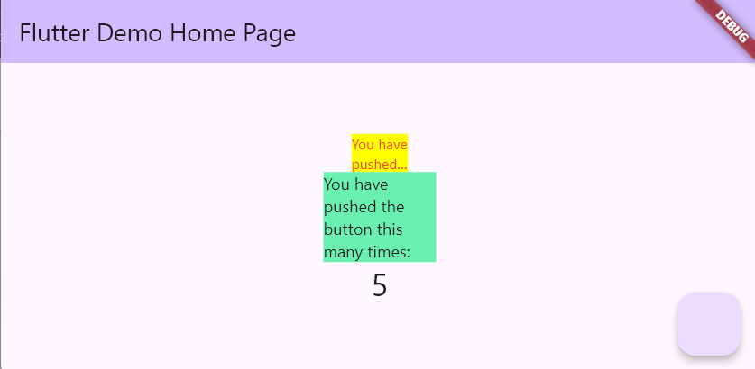

# Identitas Diri
Nama    : Rama Pramudhita Bhaskara

Kelas   : TI - 3H

NIM     : 2241720128

# Praktikum Menerapkan Plugin di Project Flutter

## Langkah 1: Buat Project Baru
Buatlah sebuah project flutter baru dengan nama flutter_plugin_pubdev. Lalu jadikan repository di GitHub Anda dengan nama flutter_plugin_pubdev.

## Langkah 2: Menambahkan Plugin
Tambahkan plugin auto_size_text menggunakan perintah berikut di terminal

```flutter pub add auto_size_text```

## Langkah 3: Buat file red_text_widget.dart
Buat file baru bernama red_text_widget.dart di dalam folder lib lalu isi kode seperti berikut.

```
import 'package:flutter/material.dart';

class RedTextWidget extends StatelessWidget {
  const RedTextWidget({Key? key}) : super(key: key);

  @override
  Widget build(BuildContext context) {
    return Container();
  }
}
```

## Langkah 4: Tambah Widget AutoSizeText
Masih di file red_text_widget.dart, untuk menggunakan plugin auto_size_text, ubahlah kode return Container() menjadi seperti berikut.

```
return AutoSizeText(
      text,
      style: const TextStyle(color: Colors.red, fontSize: 14),
      maxLines: 2,
      overflow: TextOverflow.ellipsis,
);
```
Setelah Anda menambahkan kode di atas, Anda akan mendapatkan info error. Mengapa demikian? Hal ini dikarenakan kita belum meng-*import* library AutoSizeText kita.

## Langkah 5: Buat Variabel text dan parameter di constructor
Tambahkan variabel text dan parameter di constructor seperti berikut.

```
final String text;

const RedTextWidget({Key? key, required this.text}) : super(key: key);
```

## Langkah 6: Tambahkan widget di main.dart
Buka file main.dart lalu tambahkan di dalam children: pada class _MyHomePageState

```
Container(
   color: Colors.yellowAccent,
   width: 50,
   child: const RedTextWidget(
             text: 'You have pushed the button this many times:',
          ),
),
Container(
    color: Colors.greenAccent,
    width: 100,
    child: const Text(
           'You have pushed the button this many times:',
          ),
),
```
Run aplikasi tersebut dengan tekan F5, maka hasilnya akan seperti berikut.



# Tugas Praktikum
1. Jelaskan maksud dari langkah 2 pada praktikum tersebut!
2. Jelaskan maksud dari langkah 5 pada praktikum tersebut!
3. Pada langkah 6 terdapat dua widget yang ditambahkan, jelaskan fungsi dan perbedaannya!
4. Jelaskan maksud dari tiap parameter yang ada di dalam plugin auto_size_text berdasarkan tautan pada dokumentasi ini !

**Jawaban:**

1. Perintah ini akan menambahkan entri auto_size_text ke file pubspec.yaml proyek kita.
2. Pada bagian kode tersebut, final String text menyatakan bahwa variabel text berisi teks yang nilainya tidak bisa diubah setelah diinisialisasi. Konstruktor const RedTextWidget({Key? key, required this.text}) digunakan untuk membuat objek RedTextWidget, di mana text wajib diberikan nilainya saat pembuatan objek. Kata kunci const memastikan widget ini tidak akan berubah (immutable), dan super(key: key) meneruskan key ke kelas induk untuk identifikasi widget di Flutter.
3. Dilakukan penambahan dua container pada class _MyHomePageState kedua container tersebut digunakan sebagai pembeda antara penggunaan fungsi red_text_widget dan tanpa fungsi.
4. Tabel tersebut menjelaskan parameter-parameter yang digunakan dalam library AutoSizeText di Flutter. Berikut ini penjelasan singkat dari beberapa parameter penting:
   
* key: Mengontrol bagaimana satu widget menggantikan widget lain di dalam pohon widget.
* textKey: Mengatur kunci (key) untuk widget Text yang dihasilkan.
* style: Menentukan gaya teks jika tidak bernilai null (misalnya warna, ukuran, dll.).
* minFontSize: Batas minimum ukuran teks ketika teks disesuaikan secara otomatis.
* maxFontSize: Batas maksimum ukuran teks ketika disesuaikan.
* stepGranularity: Langkah penyesuaian ukuran teks saat auto-sizing.
* presetFontSizes: Daftar ukuran font yang sudah ditentukan sebelumnya untuk penyesuaian otomatis.
* group: Menyinkronkan ukuran dari beberapa AutoSizeText secara bersamaan.
* textAlign: Menentukan bagaimana teks diratakan secara horizontal.
* textDirection: Menentukan arah teks (misalnya, kanan ke kiri atau kiri ke kanan).
* locale: Memilih font berdasarkan locale yang ditetapkan.
* softWrap: Menentukan apakah teks harus dibungkus jika melampaui batas baris.
* wrapWords: Mengatur apakah kata yang tidak cukup dalam satu baris harus dipisah ke baris berikutnya.
* overflow: Bagaimana menangani overflow (kelebihan) visual teks.
* overflowReplacement: Teks pengganti jika teks asli melampaui batas area tampilan.
* textScaleFactor: Mengontrol ukuran teks berdasarkan piksel logis per inci, mempengaruhi ukuran minimal dan maksimal teks.
* maxLines: Batas maksimum jumlah baris untuk menampilkan teks.
* semanticsLabel: Label alternatif untuk keperluan aksesibilitas.